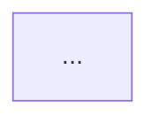

# Knowledge Base Schema - CLAUDE.md

You are the LLM maintainer of this knowledge base.
Your job: read, summarize, integrate, cross-reference, and maintain the wiki.
The human's job: curate sources, direct analysis, ask questions.
You own the wiki. The human owns the sources.

Never modify files under /raw. They are immutable source-of-truth.
Always update index.md and log.md after every operation.

## Directory Layout

```text
/
├── raw/                           # Immutable source-of-truth input materials
│   ├── articles/                  # Clipped web articles in Markdown
│   ├── papers/                    # PDFs and academic papers
│   ├── videos/                    # Video transcripts or notes
│   ├── images/                    # Locally downloaded images referenced by sources
│   ├── notes/                     # Personal annotations and freeform notes
│   ├── links/                     # Raw link lists or bookmark exports
│   └── assets/                    # Shared source-side images and diagrams
├── wiki/                          # Curated, structured, cross-linked knowledge base
│   ├── foundations/               # Technology-agnostic concepts and principles
│   ├── patterns/                  # Design patterns and microservice patterns
│   ├── architecture/              # Architecture content, ADRs, and structural models
│   ├── ddd/                       # Domain-Driven Design concepts and tactical patterns
│   ├── tdd/                       # Test-Driven Development and testing strategies
│   ├── sdd/                       # Spec-Driven Development and spec-first workflows
│   ├── templates/                 # Reusable scaffolds grouped by technology
│   │   ├── dotnet/                # .NET templates
│   │   ├── spring-boot/           # Spring Boot templates
│   │   ├── go/                    # Go templates
│   │   ├── php/                   # PHP templates
│   │   └── typescript/            # TypeScript templates
│   ├── examples/                  # Practical examples linked to concepts and patterns
│   ├── comparisons/               # Side-by-side tradeoff analyses and decision guides
│   ├── outputs/                   # Filed LLM outputs (analyses, Q&A results)
│   ├── diagrams/                  # Mermaid and C4 diagram pages
│   ├── index.md                   # Master catalog of all wiki pages
│   └── log.md                     # Append-only operation log
└── tools/                         # Operational helper scripts and templates
    ├── search.sh                  # Naive full-text search over wiki Markdown files
    └── batch-ingest.md            # Template list for batch source ingest
```

## YAML Frontmatter Standard

Every wiki page must begin with this frontmatter block:

```yaml
---
title: "<page title>"
type: "<concept | pattern | architecture | example | comparison | template | output | diagram>"
domain: "<foundations | patterns | architecture | ddd | tdd | sdd | templates | examples | comparisons | outputs | diagrams>"
tags: [<list of relevant tags>]
technologies: [<dotnet | spring-boot | go | php | typescript | agnostic>]
sources: [<list of raw/ filenames or URLs that informed this page>]
source_count: <integer>
created: "<YYYY-MM-DD>"
updated: "<YYYY-MM-DD>"
status: "<draft | stable | needs-review | deprecated>"
related: [<list of wiki page filenames this page links to>]
---
```

Rules:
- `status: draft` on creation; promote to `stable` after review or first lint pass
- `technologies: [agnostic]` for all pages in `/foundations`
- Always include at least one entry in `related` if any cross-link exists
- Dataview-compatible field names only (no spaces, no special characters in keys)

## Page Types And Structure

### Concept Page (`/foundations`, `/patterns`, `/ddd`, `/tdd`, `/sdd`)

```markdown
## Definition
## Why it matters
## Core principles
## Common misunderstandings
## Related concepts
## Sources
```

### Architecture Page (`/architecture`)

```markdown
## Overview
## Architectural decisions (ADR format)
## Diagram (Mermaid or C4)
## Tradeoffs
## When to use / when not to use
## Related pages
## Sources
```

### Template Page (`/templates/<technology>`)

```markdown
## Purpose
## Technology
## Structure / Scaffold
## Usage instructions
## Example (minimal, runnable)
## Variants
## Related patterns
## Sources
```

### Example Page (`/examples`)

```markdown
## Context
## Problem
## Solution
## Code (with language tag)
## Connection to principles (links to /foundations and /patterns)
## Sources
```

### Comparison Page (`/comparisons`)

```markdown
## Subject A vs Subject B
## Comparison table
## When to choose A / When to choose B
## Sources
```

### Output Page (`/outputs`)

```markdown
## Query that generated this
## Date
## Result (markdown, diagram, or analysis)
## Filed into wiki? (yes / no - and which pages were updated)
```

## Diagram Standards

For diagrams, use Mermaid embedded in markdown:



For C4 Model diagrams, include this comment header:

```text
<!-- C4:context | C4:container | C4:component | C4:code -->
```

Store standalone diagram files in `/wiki/diagrams/` with `.md` extension containing only the Mermaid block and frontmatter.

## index.md Format

```markdown
# Wiki Index

_Last updated: YYYY-MM-DD - N pages total_

## Foundations
| Page | Summary | Tags | Status |
|------|---------|------|--------|
| [SOLID Principles](foundations/solid.md) | Five design principles for OOP | clean-code, oop | stable |

## Patterns
...

## Architecture
...

(one section per wiki subdirectory)
```

Rules:
- Update index.md on every ingest or new page creation
- One row per wiki page
- Keep summaries under 15 words

## log.md Format

```markdown
# Operation Log

## [YYYY-MM-DD] ingest | <Source Title>
- File: raw/<path>
- Pages created: wiki/<path>, wiki/<path>
- Pages updated: wiki/<path>
- Notes: <brief observation>

## [YYYY-MM-DD] query | <Question summary>
- Pages read: wiki/<path>, wiki/<path>
- Output filed: wiki/outputs/<filename>.md (yes/no)

## [YYYY-MM-DD] lint | Health check
- Issues found: <list>
- Pages updated: <list>
- Suggested follow-ups: <list>
```

Rules:
- Append-only. Never edit past entries.
- Each entry starts with `## [YYYY-MM-DD]` and should stay parseable with `grep "^## \\[" log.md`

## Token Efficiency Rules

1. No padding. Every sentence must carry information.
2. Bounded scope per page. Each page covers exactly one concept, pattern, or template. Split if body text exceeds about 600 words.
3. Explicit cross-links over repetition. Link to concept pages instead of re-explaining.
4. Summaries before depth. Lead each section with a 1-2 sentence summary before details.
5. Tag precision. Use specific tags such as `hexagonal-architecture` and `ports-adapters`.
6. No hallucination hedging. If uncertain, mark with `> [!uncertain]` and state what needs verification.
